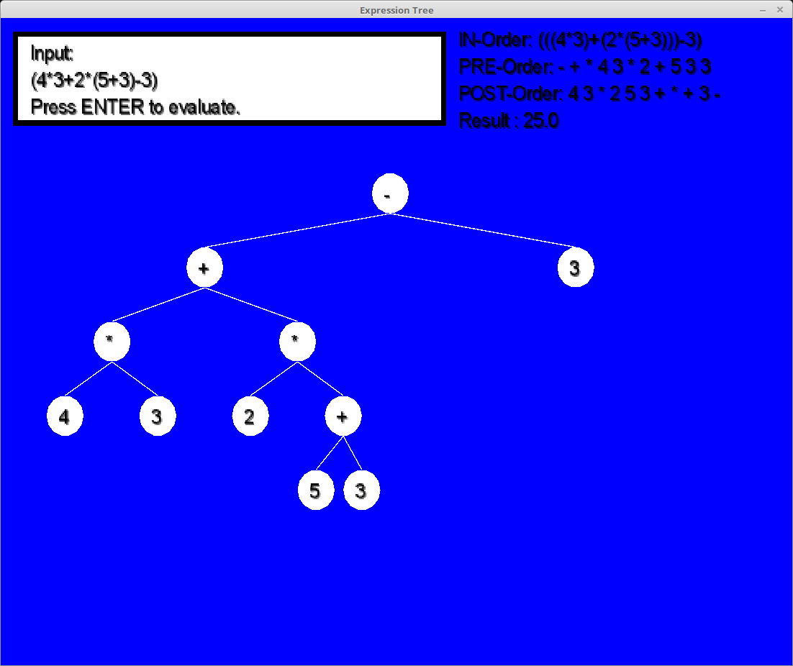

Expression Tree created with LibGDX and Java.

Download application "ExpressionTree.jar"

You can see the order of each operation.
Bugs: Exponent key doesnt work sometimes and screen dimensions may cause problems.

The tree may be drawn of position when operands are to large, plan to redo using a tree rendering library

